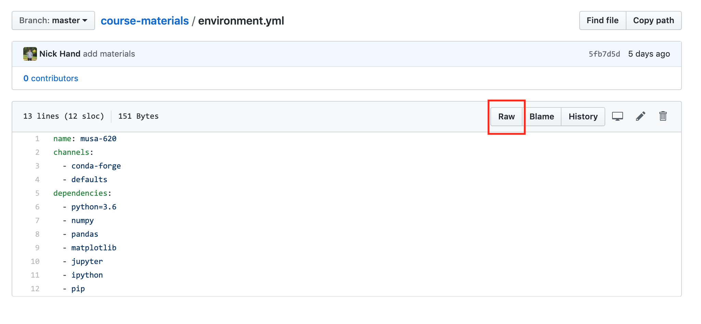
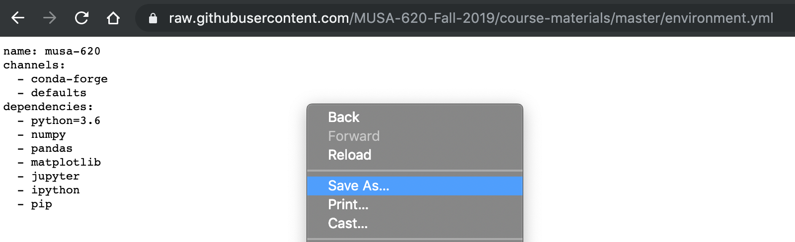

# Working with "environment.yml" files

This guide includes instructions for working with environment.yml files. It has two parts:

1. [Downloading environment.yml files](#downloading-environment-files)
1. [Updating your local environment](#updating-your-local-environment)

## Downloading environment files

Environment files can be downloaded from GitHub using two methods.

### Method 1: Saving from Github

1. Navigate to the environment file on Github, for example, the environment file in the course materials
   repository is located at: https://github.com/MUSA-620-Fall-2019/course-materials/blob/master/environment.yml

2. Click on the "Raw" button to load a version of the file that only includes the text.



3. Once the raw version is opened, right click on the whitespace and select save as.



4. Save the file to a folder on your computer, and remember the file name for part 2 below.

### Method 2: Copying/pasting from Github

1. Follow the first two steps outlined above so that you are on the "Raw" version of the environment file.
1. Copy contents of the raw environment file.
1. Open up a plain text editor (either Notepad on Windows or TextEdit on Mac OS) and paste the contents of the file.
1. Save the file as "environment.yml" to a folder on your computer, and remember the file name for part 2 below.

### Important

When saving the environment file to your computer, following either of the methods above, make sure the file is saved with a .yml file extenstion. Sometimes, a .txt file extension will be automatically added to the end of the file name, which can create issues when trying to use the environment file. On Windows, the file extension can be changed using [these instructions](https://www.mediacollege.com/microsoft/windows/extension-change.html).

## Updating your local environment

After following the instructions for part 1 of this guide, you should have an environment file saved somewhere on your computer. Let's imagine the file is located at:

/Users/YourUserName/Desktop/environment.yml (on a Mac),

or

C:\Users\YourUserName\Desktop\environment.yml

Your local environment can be updated to match this file by using the following steps:

**Step 1.** On Windows, open the Anaconda Prompt, or on Mac, open the Terminal.

**Step 2.** Navigate to the folder where the environment file is located. From the Prompt or Terminal run:

**Windows**

```
cd C:\Users\YourUserName\Desktop
```

**Mac**

```
cd /Users/YourUserName/Desktop/
```

Be sure to use the true location of the file on your computer. This will set the current "working directory" of the Prompt/Terminal to the folder location. You can confirm the contents of your current working directory by running:

**Windows**

```
dir
```

**Mac**

```
ls
```

**Step 3.** Then we can update your local environment using:

```
conda env update --name musa-620 --file environment.yml
```

(Assuming the file is called "environment.yml")
